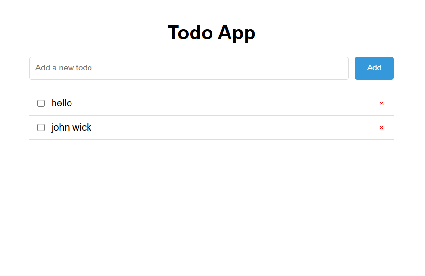

# Todo App in React and SCSS

Let’s build a simple Todo app using React and SCSS. The app will allow users to add, mark as completed, and delete todo items.

Here’s a step-by-step guide to creating the Todo app:

### 1. Setting Up the Project

First, set up a new React project and install the necessary dependencies:

```bash
npx create-react-app todo-app
cd todo-app
npm install sass
```

### 2. Project Structure

Here’s the structure of our project:

```java
todo-app/
│
├── public/
│   └── index.html
│
├── src/
│   ├── components/
│   │   ├── TodoForm.js
│   │   ├── TodoItem.js
│   │   └── TodoList.js
│   │
│   ├── styles/
│   │   └── App.scss
│   │
│   ├── App.js
│   └── index.js
│
└── package.json
```

### 3. Create Components

`TodoForm.js`
This component will handle adding new todos.

```jsx
// src/components/TodoForm.js
import React, { useState } from "react";

const TodoForm = ({ addTodo }) => {
  const [inputValue, setInputValue] = useState("");

  const handleSubmit = (e) => {
    e.preventDefault();
    if (inputValue.trim()) {
      addTodo(inputValue);
      setInputValue("");
    }
  };

  return (
    <form onSubmit={handleSubmit} className="todo-form">
      <input
        type="text"
        value={inputValue}
        onChange={(e) => setInputValue(e.target.value)}
        placeholder="Add a new todo"
      />
      <button type="submit">Add</button>
    </form>
  );
};

export default TodoForm;
```

`TodoItem.js`
This component represents each todo item.

```jsx
// src/components/TodoItem.js
import React from "react";

const TodoItem = ({ todo, toggleComplete, removeTodo }) => {
  return (
    <li className={`todo-item ${todo.completed ? "completed" : ""}`}>
      <input
        type="checkbox"
        checked={todo.completed}
        onChange={() => toggleComplete(todo.id)}
      />
      {todo.text}
      <button onClick={() => removeTodo(todo.id)}>&times;</button>
    </li>
  );
};

export default TodoItem;
```

`TodoList.js`
This component displays the list of todos.

```jsx
// src/components/TodoList.js
import React from "react";
import TodoItem from "./TodoItem";

const TodoList = ({ todos, toggleComplete, removeTodo }) => {
  return (
    <ul className="todo-list">
      {todos.map((todo) => (
        <TodoItem
          key={todo.id}
          todo={todo}
          toggleComplete={toggleComplete}
          removeTodo={removeTodo}
        />
      ))}
    </ul>
  );
};

export default TodoList;
```

### 4. App Component

The `App` component will manage the state and render the `TodoForm` and `TodoList` components.

```jsx
// src/App.js
import React, { useState } from "react";
import TodoForm from "./components/TodoForm";
import TodoList from "./components/TodoList";
import "./styles/App.scss";

const App = () => {
  const [todos, setTodos] = useState([]);

  const addTodo = (text) => {
    setTodos([...todos, { id: Date.now(), text, completed: false }]);
  };

  const toggleComplete = (id) => {
    setTodos(
      todos.map((todo) =>
        todo.id === id ? { ...todo, completed: !todo.completed } : todo
      )
    );
  };

  const removeTodo = (id) => {
    setTodos(todos.filter((todo) => todo.id !== id));
  };

  return (
    <div className="app">
      <h1>Todo App</h1>
      <TodoForm addTodo={addTodo} />
      <TodoList
        todos={todos}
        toggleComplete={toggleComplete}
        removeTodo={removeTodo}
      />
    </div>
  );
};

export default App;
```

### 5. SCSS Styling

Create the `App.scss` file in the `styles` directory for styling the app.

```scss
// src/styles/App.scss
$primary-color: #3498db;
$completed-color: #95a5a6;

.app {
  max-width: 600px;
  margin: 0 auto;
  padding: 20px;
  font-family: Arial, sans-serif;

  h1 {
    text-align: center;
  }
}

.todo-form {
  display: flex;
  justify-content: space-between;
  margin-bottom: 20px;

  input {
    flex: 1;
    padding: 10px;
    border: 1px solid #ddd;
    border-radius: 4px;
  }

  button {
    padding: 10px 20px;
    border: none;
    background-color: $primary-color;
    color: white;
    cursor: pointer;
    border-radius: 4px;
    margin-left: 10px;
    transition: background-color 0.3s;

    &:hover {
      background-color: darken($primary-color, 10%);
    }
  }
}

.todo-list {
  list-style: none;
  padding: 0;

  .todo-item {
    display: flex;
    align-items: center;
    padding: 10px;
    border-bottom: 1px solid #ddd;

    &.completed {
      color: $completed-color;
      text-decoration: line-through;
    }

    input {
      margin-right: 10px;
    }

    button {
      margin-left: auto;
      background: none;
      border: none;
      color: red;
      cursor: pointer;
    }
  }
}
```

### 6. Final Steps

- **Run the app** :

```bash
npm start
```

- **Open** your browser and navigate to `http://localhost:3000`. You should see your Todo app in action!


